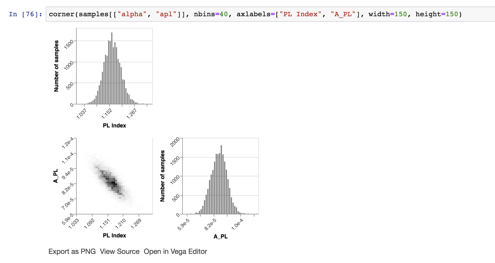

Corner Plots in Altair
======================

This code makes corner plots (similar to [corner.py](http://joss.theoj.org/papers/10.21105/joss.00024) using [Altair](https://altair-viz.github.io) instead of matplotlib. Under development.

Example
-------

Here's an example:

